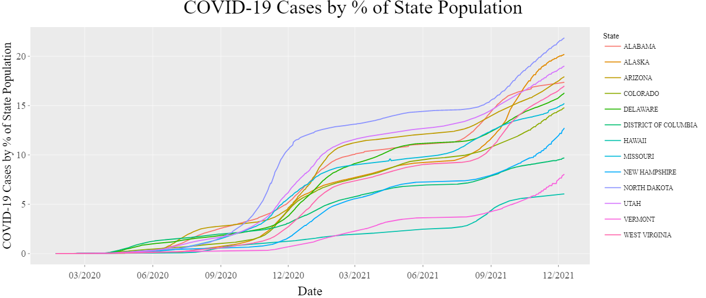
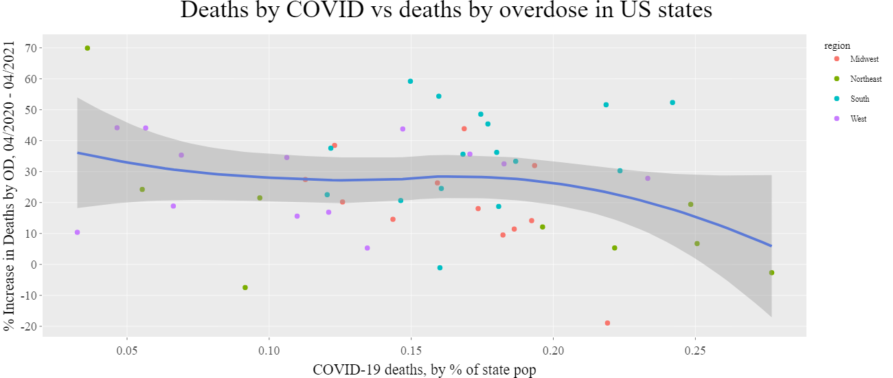
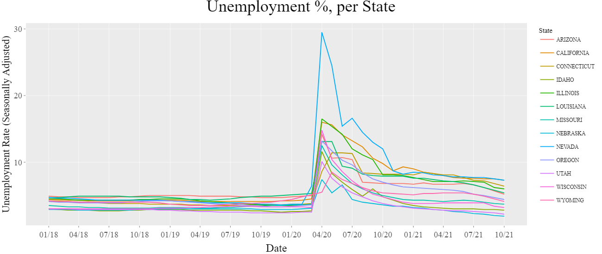
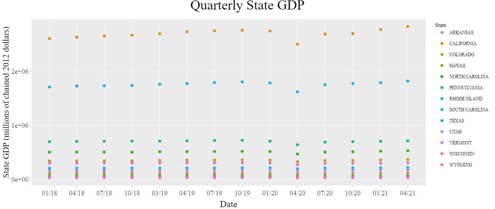
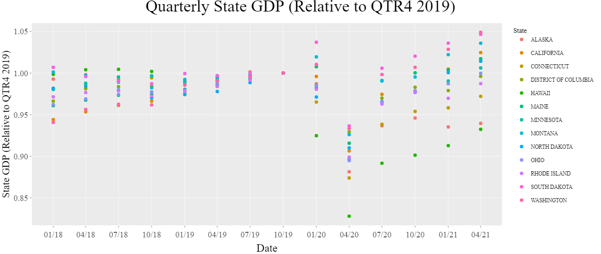

```{r setup, include=FALSE}
knitr::opts_chunk$set(
  echo = FALSE,
  warning = FALSE,
  message = FALSE,
  fig.align = 'center',
  fig.width=10
  )
```

```{r libraries, include = FALSE}
library(httr)
library(xml2)
library(data.table)
library(ggplot2)
library(tidyverse)
library(lubridate)
library(rvest)
library(stringr)
library(ggsci)
library(plotly)
library(zoo)
library(extrafont)
#loadfonts(device = "win")
```

# Introduction

Drug overdose deaths in the United States have been rising steadily since the turn of the century, and a significant increase in this trend has been observed since the mid-2010's. Public discourse around this tragedy led to cultural and political changes which appeared to have slowed the trend around 2018. Then, in March 2020, the COVID-19 pandemic led to an upheaval in nearly every aspect of daily life, resulting in drastic changes to the way we work, socialize, and interact with society at large.

To slow the spread of the virus, most public gathering places were shut down, leading to widespread loss of jobs and a crash of the economy. Those with job security soon found new ways to work through the pandemic, and those without it found themselves without a job and an income.

There is good reason to expect that the devastation wrought by COVID-19 would include increased deaths by overdose. Substance abuse is associated with people experiencing unemployment or underemployment, lack of career opportunities, social isolation, mental health issues, and homelessness. As COVID-19 has undeniably contributed to each of these factors, an investigation into the pandemic’s effect on the substance abuse crisis is warranted.

```{r state_names}
abbrev2 <- read_html(x = "https://simple.wikipedia.org/wiki/List_of_U.S._states_by_traditional_abbreviation")
abtable2 <- xml_find_all(abbrev2, xpath = "/html/body/div[3]/div[3]/div[5]/div[1]/table[1]/tbody")
abtable2 <- html_table(abtable2)
abtable2 <- rbindlist(abtable2)
abtable2 <- abtable2[, .(State, Otherabbreviations)]
setnames(abtable2, "State", "state_name")
setnames(abtable2, "Otherabbreviations", "state_abbreviation")
abtable2$state_name = toupper(abtable2$state_name)
abtable2$state_abbreviation = toupper(abtable2$state_abbreviation)
abtable2$state_abbreviation <- str_replace_all(abtable2$state_abbreviation, "[[:punct:]]", "")
abtable2[11,1] <- "GEORGIA"
abtable2 <- abtable2 %>% add_row(state_name = "UNITED STATES", state_abbreviation = "US")
abtable2 <- abtable2[order(state_name)]
```

```{r census_api}
# https://www.census.gov/data/developers/guidance/api-user-guide.Example_API_Queries.html
# Retrieving dimensions
if (!exists("censusquery")){
censusquery <- GET(
  url = "https://api.census.gov/data/2019/pep/population?get=NAME,POP&for=state:*"
)
}

# Checking if the website is active
#censusquery$status_code

# Processing data
census_content <- content(censusquery)
census <- rbindlist(census_content)
census <- census[-1,]
setnames(census, "V2", "population")
setnames(census, "V1", "state_name")
setnames(census, "V3", "state_number")
census$population <- as.numeric(census$population)
census$state_number <- as.numeric(census$state_number)
census <- census %>% add_row(state_name = "United States", population = sum(census$population), state_number = 57)
census <- census[order(state_name)]

#Combining census and abtable data.tables
census$state_name = toupper(census$state_name)
census <- merge(census, abtable2)
#census$population <- as.numeric(census$population)
#census$population <- as.numeric(census$population)
```

```{r regions}
divisions <- fread('data/us_divisions.csv')
divisions$State = toupper(divisions$State)

# merge with census
census <- merge(census, divisions, by.x = "state_name", by.y = "State", all.x = TRUE)
census$'State Code' <- NULL
census$Division <- NULL
setnames(census, "Region", "region")
```

# The COVID-19 pandemic in the US

```{r covid_api}
# Retrieving dimensions
if(!exists("covidquery")){
covidquery <- GET(
  url = "https://data.cdc.gov/resource/9mfq-cb36.json?$limit=50000"
)
}

# Checking if the website is active
#covidquery$status_code

# Processing data
covid_content <- content(covidquery)

covid <- rbindlist(covid_content[1:length(covid_content)], fill=TRUE)
covid$date <- as.Date(covid$submission_date)
covid$tot_death <- as.numeric(covid$tot_death)
covid$tot_cases <- as.numeric(covid$tot_cases)
covid$new_case <- as.numeric(covid$new_case)
covid$new_death <- as.numeric(covid$new_death)

# Removing extraneous columns from 'covid'
covid <- covid[, .(state, tot_cases, new_case, tot_death, new_death, date)]
covid <- covid[order(state, date)]
```

```{r merge_census_covid}
#Combining census and covid data.tables
covid <- merge(covid, census, by.x = "state", by.y = "state_abbreviation")
covid$population <- as.numeric(covid$population)
```

```{r covid_population_norming}
# Creating death_perc, total death / total population
covid$death_perc <- covid$tot_death * 100 / covid$population
covid$case_perc <- covid$tot_cases * 100 / covid$population
covid$newdeath_perc <- covid$new_death * 100 / covid$population
covid$newcase_perc <- covid$new_case * 100 / covid$population

# Summing up COVID data from all states, for total US values
covid_usa <- aggregate(cbind(tot_cases, new_case, tot_death, new_death, death_perc, case_perc, newdeath_perc, newcase_perc, population) ~ date, data = covid, FUN = sum, na.rm = TRUE)
```

```{r covid_usa_plot}
gct <- ggplot(covid_usa, aes(x = date, y = new_case)) +
  geom_line() +
  labs(title = "New US COVID-19 cases", subtitle = "Source: data.cdc.gov API") +
  geom_vline(xintercept=as.numeric(covid_usa$date[52]), linetype="dashed", size = 1) +
  annotate(geom = "text", x = covid_usa$date[60], y = 150000, label = "Emergency Declaration", angle = 90, color = "blue") +
  geom_vline(xintercept=as.numeric(covid_usa$date[109]), linetype="dashed", size = 1) +
  annotate(geom = "text", x = covid_usa$date[117], y = 150000, label = "14.7% Unemployment", angle = 90, color = "blue") +
  geom_vline(xintercept=as.numeric(covid_usa$date[416]), linetype="dashed", size = 1) +
  annotate(geom = "text", x = covid_usa$date[424], y = 150000, label = "100 Million Vaccinations", angle = 90, color = "blue")+
  geom_vline(xintercept=as.numeric(covid_usa$date[329]), linetype="dashed", size = 1) +
  annotate(geom = "text", x = covid_usa$date[337], y = 60000, label = "Vaccination Begins", angle = 90, color = "blue") +
  geom_vline(xintercept=as.numeric(covid_usa$date[527]), linetype="dashed", size = 1) +
  annotate(geom = "text", x = covid_usa$date[535], y = 150000, label = "Delta Variant Spreads", angle = 90, color = "blue") +
  xlab("Date") + ylab("New COVID-19 cases") +
  theme(text = element_text(family = "Times New Roman"), plot.title = element_text(hjust = 0.5, size = 20), plot.subtitle = element_text(hjust = 0.5))

#gct

ggsave(filename = "data/covidplot0.png", plot = gct, units = "px", width = 3000, height = 1500)

```


\begin{footnotesize}
Figure 1: A timeline of COVID-19 cases in the US, with significant events specified.
\end{footnotesize}

COVID-19 was first detected in the USA on January 17, 2020, in Washington State. By March 13, 2020, President Trump had declared a nationwide emergency, and 2 days later, schools and restaurants began to shut down. By May 9th, 2020, the unemployment rate hit 14.7%, the worst rate since the Great Depression. By September 2020, the US COVID-19 death toll surpassed 200,000, and by January 18, 2021, it had doubled to 400,000. On December 14th, 2020, the initial phase of the vaccination program began, and by March 13, 2021, the US had surpassed 100 million vaccinations administered. By July 1st, 2021, the highly infectious delta variant had become detected in all 50 US States.

There has been considerable difference between how each of the US States has experienced COVID-19:

\hfill\break

```{r covid_graph_by_state}
# Making the plot less chaotic by reducing it to 11 states
covid_max <- covid[ , .SD[which.max(date)], by = state]
statesspan = c(1, 2, 6, 11, 16, 21, 26, 31, 36, 41, 46, 50, 51)

covidplotdf1 <- covid_max[order(-case_perc)] %>% slice(statesspan)
covidplotstates1 <- unique(covidplotdf1$state)
covidplotdf_case <- filter(covid, state %in% covidplotstates1)

covidplotdf2 <- covid_max[order(-death_perc)] %>% slice(statesspan)
covidplotstates2 <- unique(covidplotdf2$state)
covidplotdf_death <- filter(covid, state %in% covidplotstates2)


# Plotting covid deaths by population percent
ccpp <- ggplot(covidplotdf_case, aes(x = date, y = case_perc, color = state_name)) +
  geom_line() +
  labs(title = "COVID-19 Cases by % of State Population", subtitle = "Source: data.cdc.gov API", color = "State") +
  xlab("Date") + ylab("COVID-19 Cases by % of State Population")

cdpp <- ggplot(covidplotdf_death, aes(x = date, y = death_perc, color = state_name)) +
  geom_line() +
  labs(title = "COVID-19 Deaths by % of State Population", subtitle = "Source: data.cdc.gov API", color = "State")+
  xlab("Date") + ylab("COVID-19 Deaths by % of State Population")
```

```{r}
ggccpp <- ggplotly(ccpp) %>% layout(title = "COVID-19 Cases by % of State Population", font = list(size = 26, family = "Times New Roman"), xaxis = list(title = "Date", titlefont = list(size = 24), tickfont = list(size = 18)), yaxis = list(title = "COVID-19 Cases by % of State Population", titlefont = list(size = 22), tickfont = list(size = 18)))
orca(ggccpp, file = "data/covidplot1.png", width = 1300, height = 550)
```



\begin{footnotesize}
Figure 2: A representative sample of cumulative COVID-19 cases per US state.
\end{footnotesize}

 

```{r}
ggcdpp <- ggplotly(cdpp) %>% layout(title = "COVID-19 Deaths by % of State Population", font = list(size = 26, family = "Times New Roman"), xaxis = list(title = "Date", titlefont = list(size = 24), tickfont = list(size = 18)), yaxis = list(title = "COVID-19 Deaths by % of State Population", titlefont = list(size = 22), tickfont = list(size = 18)))
orca(ggcdpp, file = "data/covidplot2.png", width = 1300, height = 550)
```


```{r}
covid_max <- covid_max[order(-death_perc)]
```

\begin{footnotesize}
Figure 3: A representative sample of cumulative COVID-19 associated deaths per US state.
\end{footnotesize}

 

The state with the highest number deaths per population, `r covid_max[1,state_name]` (`r covid_max[1,death_perc] * 100`%), has experienced per population mortality rates `r format(round(covid_max[1,death_perc] * 100 / covid_max[nrow(covid_max),death_perc]), 2)`% higher than that of the lowest number of deaths per population, `r covid_max[nrow(covid_max),state_name]` (`r covid_max[nrow(covid_max),death_perc] * 100`%).

These differences are a result of a complicated web of interconnected variables: geography, viral transmission tendencies, the extent to which the state and local governments enforced lockdown measures, the culture of the communities and how rigorously they practiced social distancing, the types of economies typical of each region, and many more.

Having the above information in hand will help provide perspective as a preliminary investigation into US drug useage patterns is explored.

```{r drugs_api}
# Retrieving dimensions
# https://data.cdc.gov/NCHS/VSRR-Provisional-Drug-Overdose-Death-Counts/xkb8-kh2a

if(!exists("drugsquery")){
drugsquery <- GET(url = "https://data.cdc.gov/resource/xkb8-kh2a.json?$limit=50000")
}

# Checking if the website is active
#drugsquery$status_code

# Processing data
drugs_content <- content(drugsquery)

# Turning the list into a data.table
drugs <- rbindlist(drugs_content[1:length(drugs_content)], fill=TRUE)
drugs$state_name = toupper(drugs$state_name)
```

```{r drugs-processing2}
# Cleaning up the drugs data.table
drugs$date <- as.Date(paste0(drugs$year, drugs$month, "01"), format="%Y%B%d")
setnames(drugs, "data_value", "deaths")
drugs$deaths <- as.numeric(drugs$deaths)

# Combining drugs and census data
drugs <- merge(drugs, census, by = "state_name", all = TRUE)

# Removing extraneous columns from 'drugs'
drugs <- drugs[, .(state_name, state, indicator, deaths, date, year, population, state_number, region)]

# Cleaning up drugs$indicator column
drugs$indicator <- gsub("\\([^()]*\\)", "", drugs$indicator)
drugs$indicator <- str_trim(drugs$indicator, side = c("both"))
drugs <- drugs[indicator != "Percent with drugs specified"]

# Making a deaths per population column
drugs$odpop_perc <- drugs$deaths * 100 / drugs$population

# Dropping rows where deaths == NA
drugs <- drugs %>% drop_na(deaths)
drugs <- drugs[state != "DC"]
drugs <- drugs[order(state_number, date)]
```

# The drug mortality crisis in the US

The CDC offers a vast and thorough dataset providing monthly 12-month rolling sums of overdose deaths by state, categorized by drug type (heroin, cocaine, opioids, etc.) as well as drug type subcategories (synthetic opioids, natural & semi-synthetic opioids, etc.).

Shown below is a plot of overdoses in the US from 2015-2021, broken down by drug type and sub-type. Some of these are independent of all others: Psychostimulants (methamphedamine) and cocaine have their own categories. Others share data: there is one category for all opioids, another for natural opioids, and another for synthetic opioids.

\hfill\break

```{r drugs_usa_plot}
# Filtering DF to be just US
drugs_usa <- drugs %>% filter(state == "US")
drugs_usa <- drugs_usa[order(date, indicator)]

drugs_usa <- drugs_usa[!indicator %in% c("Number of Deaths", "Natural, semi-synthetic, & synthetic opioids, incl. methadone", "Natural & semi-synthetic opioids, incl. methadone", "Methadone")]
drugs_usa$region <- NULL

# Plot all indicators
gdu <- ggplot(drugs_usa, aes(x = date, y = deaths, color = indicator)) +
  geom_line(size = 1) +
  geom_vline(xintercept=as.Date("2020-02-01"), linetype="dashed", size = 0.5) +
  annotate(x = as.Date("2019-11-01"), y = 70000, label = "Start of COVID-19", geom="text", angle = 90, size = 4) +
  labs(x = "Date", y = "12 month rolling sum of deaths from OD", title = "Total US Deaths by OD from Significant Drug Categories, 2015-2021\n", color = "Substance") +
  scale_x_date(date_breaks = "year",  date_labels = "%Y") +
  theme(text = element_text(family = "Times New Roman"), legend.title = element_text(size = 8), legend.text = element_text(size = 7), plot.title = element_text(hjust = 0.5, size = 20))

#gdu

ggsave(filename = "data/ODplot0.png", plot = gdu, units = "px", width = 3000, height = 1500)
```


\begin{footnotesize}
Figure 4: Overdoses in the US by implicated substance.
\end{footnotesize}
  
```{r drugs_usa_2_3}
indicators = unique(drugs$indicator)
indicators2 <- c(indicators[3], indicators[6], indicators[7], indicators[8], indicators[9], indicators[11])
indicators3 <- c(indicators[2], indicators[7], indicators[3], indicators[8])

drugs_usa2 <- drugs_usa[indicator %in% indicators2]
drugs_usa3 <- drugs_usa[indicator %in% indicators3]
```

This plot immediately suggests some insights. For one, there does appear to be a clear uptick in the rate of drug overdose deaths per year following the onset of the COVID-19 pandemic. Also, it is the opioids that are by far the most implicated drug, and it's the synthetic, not the natural opioids, that are the primary driver. Natural opioids are those such as morphine and codeine; common semi-synthetic opioids are hydrocodone and oxycodone.

```{r drugs_usa3_plot}
gdu3 <- ggplot(drugs_usa3, aes(x = date, y = deaths, color = indicator)) +
  geom_line(size = 1.4) +
  geom_vline(xintercept=as.Date("2020-02-01"), linetype="dashed", size = 1) +
  labs(x = "Date", y = "12 month rolling sum of OD deaths by drug category", title = "Opioid contribution to total overdose deaths", color = "State")

#ggplotly(gdu3)
```


```{r}
# gggdu3 <- ggplotly(gdu3) %>% layout(title = "Opioid contribution to total overdose deaths", font = list(size = 18))
# orca(gggdu3, file = "data/ODplot1.png", width = 1300, height = 550)
```

According to numerous government agencies, the synthetic opioid behind this great increase is fentanyl, which is often illicitly manufactured and commonly used to lace other drugs. As little as two milligrams of fentanyl can be lethal.

```{r max_min_date_drugs}
# the most recent values in the drugs dataset
maxod <- drugs_usa[date == "2021-04-01" & indicator == "Number of Drug Overdose Deaths"]
maxsynth <- drugs_usa[date == "2021-04-01" & indicator == "Synthetic opioids, excl. methadone"]

minod <- drugs_usa[date == "2015-01-01" & indicator == "Number of Drug Overdose Deaths"]
minsynth <- drugs_usa[date == "2015-01-01" & indicator == "Synthetic opioids, excl. methadone"]
```

In January 2015 - the earliest data provided in this dataset - synthetic opioids accounted for `r format(round(minsynth$deaths * 100 / minod$deaths, 0))`% of all overdose deaths. As of March 01, 2021 - the most recent data provided in this dataset - synthetic opioids were responsible for `r format(round(maxsynth$deaths * 100 / maxod$deaths, 0))`% of all drug overdose deaths in the US. During this time, the total number of deaths due to synthetic opioids grew by `r format(round(maxsynth$deaths * 100/ minsynth$deaths, 0))`%.

Similar to the disparity in how each state experienced the COVID-19 pandemic, each state is experiencing the drug epidemic in its own way:

```{r od_deaths_states_plots}
# Making a data.table of just "Number of Drug Overdose Deaths"
od_deaths <- drugs[indicator == "Number of Drug Overdose Deaths"]
od_deaths <- od_deaths[state_name != "UNITED STATES"]
od_deaths <- od_deaths[order(state_name, date)]
```

```{r percent-increase-drugs-by-state}
od_min <- od_deaths[ , .SD[which.min(date)], by = state_name] #2015-01-01
od_realmax <- od_deaths[ , .SD[which.max(date)], by = state_name]
od_max <- od_deaths[date == "2021-04-01"] #Let's just keep this here
od_0420 <- od_deaths[date == "2020-04-01"]

# Percent increase from March 2020 to March 2021
od_max$odincrease_apr20apr21 <- (od_max$deaths - od_0420$deaths) * 100 / od_0420$deaths
```

```{r}
# 
odplotdf1 <- od_realmax[order(-odpop_perc)] %>% slice(statesspan)
odplotstates1 <- unique(odplotdf1$state)
odplotdf <- filter(od_deaths, state %in% odplotstates1)
```

```{r}
# Plotting od deaths scaled by population
allodpop <- ggplot(odplotdf, aes(x = date, y = odpop_perc, color = state_name)) +
  geom_line() +
  labs(title = "12 month rolling sum of OD deaths, by % of state pop", x = "Date", y = "12 month rolling sum of OD deaths, by % of state pop.", color = "State")
```

```{r plot_odstates}
#ggplotly(allodpop)
```

```{r}
ggallodpop <- ggplotly(allodpop) %>% layout(title = "12 month rolling sum of OD deaths, by % of state pop", font = list(size = 26, family = "Times New Roman"), xaxis = list(title = "Date", titlefont = list(size = 24), tickfont = list(size = 18)), yaxis = list(title = "12 month rolling sum of OD deaths, by % of state pop.", titlefont = list(size = 22), tickfont = list(size = 18)))

orca(ggallodpop, file = "data/ODplot2.png", width = 1300, height = 550)
```


\begin{footnotesize}
Figure 5: Overdose deaths per year, in a representative sample of US states.
\end{footnotesize}

# How has COVID-19 affected the overdose crisis?

The reasons why states have historically experienced the drug overdose epidemic so differently are numerous and complicated. In an effort to strip away the noise of confounding variables and determine if there is a true relationship with the COVID-19 pandemic, two different questions are asked below:

Whether statewide *COVID-19 deaths* per capita is correlated with the *percentage increase in deaths due to overdose* in a year, per capita

AND

Whether statewide *COVID-19 cases* per capita is correlated with *non-normalized deaths due to overdose* per capita.

\hfill\break

```{r covid-vs-drugs plots}
# Covid data from 03.21 with OD % increase data from 04.20-04.21
covid_0421 <- covid[date == "2021-04-01"]
covid_od <- merge.data.frame(covid_0421, od_max)

od_cov1 <- ggplot(covid_od, aes(x = death_perc, y = odincrease_apr20apr21, label = state_name)) +
  geom_point(aes(color = region)) +
  geom_smooth() +
  labs(title = "Deaths by COVID vs deaths by overdose in US states", x = "COVID-19 deaths, by % of state pop", y = "% increase in deaths by OD, 04/20-04/21", subtitle = "Source: data.cdc.gov API")

od_cov2 <- ggplot(covid_od, aes(x = case_perc, y = odpop_perc, label = state_name)) +
  geom_point(aes(color = region)) +
  geom_smooth() +
  labs(title = "Cases of COVID vs deaths by overdose in US states", x = "% of state pop infected by COVID-19", y = "% of total state population killed by OD, April 2020 - April 2021", subtitle = "Source: data.cdc.gov API")
```


```{r plot_covidvsod}
#ggplotly(od_cov1)
```

```{r}
ggod_cov1 <- ggplotly(od_cov1) %>% layout(title = "Deaths by COVID vs deaths by overdose in US states", font = list(size = 26, family = "Times New Roman"), xaxis = list(title = "COVID-19 deaths, by % of state pop", titlefont = list(size = 22), tickfont = list(size = 18)), yaxis = list(title = "% Increase in Deaths by OD, 04/2020 - 04/2021", titlefont = list(size = 22), tickfont = list(size = 18)))
orca(ggod_cov1, file = "data/ODplot3.png", width = 1300, height = 550)
```



\begin{footnotesize}
Figure 6: COVID-19 deaths up until April 2021 by % of state population plotted against the % increase in yearly deaths by overdose from April 2020 to April 2021, per state. The trend has high variance and is slightly negatively correlated. There are small clusters of regional similarity, but no trends to draw any conclusions from.
\end{footnotesize}

 

```{r plot_covidvsod2}
#ggplotly(od_cov2)
```

```{r}
ggod_cov2 <- ggplotly(od_cov2) %>% layout(title = "Cases of COVID vs deaths by overdose in US states", font = list(size = 26, family = "Times New Roman"), xaxis = list(title = "% of state pop infected by COVID-19", titlefont = list(size = 22), tickfont = list(size = 18)), yaxis = list(title = "% of Total State Population Killed by OD, 04/2020 - 04/2021", titlefont = list(size = 22), tickfont = list(size = 18)))
orca(ggod_cov2, file = "data/ODplot4.png", width = 1300, height = 550)
```


\begin{footnotesize}
Figure 7: COVID-19 cases up until April 2021 by % of state population plotted against the % of total state population killed by overdose. The trend has high variance and is slightly negatively correlated.
\end{footnotesize}

\hfill\break

A visualization of the geographical distribution of these factors may uncover some regional trends:

```{r maps}
g <- list(
  scope = 'usa',
  projection = list(type = 'albers usa'),
  lakecolor = toRGB('white')
)
```


```{r map_covid}
# Covid death as a percentage of state population, most recent available data
map1 <- plot_geo() %>%
  add_trace(
    z = ~covid_od$death_perc, text = covid_od$state_name, span = I(0),
    locations = covid_od$state, locationmode = 'USA-states'
  ) %>%
  layout(geo = g, title = '\nUS COVID-19 Associated Deaths \n(Through April 2021)', font = list(size = 42, family = "Times New Roman")) %>%
  colorbar(title = "% of State\nPopulation")

```

```{r}
orca(map1, file = "data/map1.png", width = 2000, height = 1100)
```


\begin{footnotesize}
Figure 8: Regional trends in COVID-19 associated deaths.
\end{footnotesize}

```{r map_ods}
# OD deaths as a percentage of state population since COVID began
map2 <- plot_geo() %>%
  add_trace(
    z = ~covid_od$odincrease_apr20apr21, text = covid_od$state_name, span = I(0),
    locations = covid_od$state, locationmode = 'USA-states'
  ) %>%
  layout(geo = g, title = '\nUS % Increase in OD Associated Deaths per Year \n(04/2020 to 04/2021)', font = list(size = 42, family = "Times New Roman")) %>%
  colorbar(title = "% Increase\nover 1 year")
```

```{r}
orca(map2, file = "data/map2.png", width = 2000, height = 1100)
```


\begin{footnotesize}
Figure 9: Regional trends in deaths due to overdose, % increase from the year ending in April 2020 to the year ending in April 2021.
\end{footnotesize}

The maps highlight a few areas (the southeastern US) where COVID-19 and deaths due to overdose seem to correlate, as well as contrasting areas (the northern midwest, the New England area) where they seem inversely related.

The scatter plots indicate that there is either no relation between the two factors, or there is even a negative correlation.

While this may seem counterintuitive, COVID-19 affected the US in more ways than just the mortalities from the virus itself. The economic shutdown and enforced social distancing changed the way basic ways in which our lives are lived, and these are the types of disruptions that could lead to increased drug usage: social isolation, joblessness, and the associated mental health effects. One conjecture which might explain the negative correlation seen above is that those states which experienced the lowest COVID-19 mortalities endured the most severe lockdowns - resulting in lower virus associated deaths but higher social isolation and a more damaged economy.

To investigate this possibility, another dataset will be introduced into this analysis: monthly unemployment data in the 50 US states.

## COVID-19 associated unemployment vs deaths by overdose

Upon realization of the severity of the pandemic spreading throughout the country, a series of business shutdowns were enforced at each of the county, state, and federal levels. Due to this patchwork approach to shutdown laws as well as the unique nature of the economies of each state, there was marked difference between the way each state experienced unemployment and financial downturn. Hawaii and Nevada stand out in particular, as tourism makes up a large sector of their economies.

```{r unemployment_fread}
# https://www.bls.gov/lau/data.htm

unemployment <- fread("data/stateunemployment.csv")
unemployment <- head(unemployment, -3)
unemployment <- melt(unemployment, id.vars="STATE", variable.name = "date")

UD <- unemployment$date
UDF <- as.Date(paste0("01-", UD), format = "%d-%b-%y")
unemployment$date <- UDF
unemployment <- unemployment[order(STATE, date)]
```

```{r}
# unemployment max 
unemp_max <- unemployment[ , .SD[which.max(date)], by = STATE]

#
unempplotdf1 <- unemp_max[order(-value)] %>% slice(statesspan)
unempplotstates1 <- unique(unempplotdf1$STATE)
unempplotdf <- filter(unemployment, STATE %in% unempplotstates1)
```

```{r unemployment_investigation}
unemployment_plot <- unempplotdf %>% filter(date >= "2018-01-01")
unem <- ggplot(unemployment_plot, aes(x = date, y = value, color = STATE)) +
  geom_line() +
  labs(title = "Unemployment %, per State", x = "Date", y = "Unemployment Rate (Seasonally Adjusted)", subtitle = "Source: US Bureau of Labor Statistics", color = "State")

#ggplotly(unem)
```

```{r}
ggunem <- ggplotly(unem) %>% layout(title = "Unemployment %, per State", font = list(size = 26, family = "Times New Roman"), xaxis = list(title = "Date", titlefont = list(size = 24), tickfont = list(size = 18)), yaxis = list(title = "Unemployment Rate (Seasonally Adjusted)", titlefont = list(size = 22), tickfont = list(size = 18)))
orca(ggunem, file = "data/unem1.png", width = 1300, height = 550)
```



\begin{footnotesize}
Figure 10: The unemployment rate in a representative sample of US states.
\end{footnotesize}

 

To examine the possibility that the unemployment experienced as a result of the COVID-19 lockdowns led to increased drug usage and deaths by overdose, below is a visualization of the relationship between these factors: The *relative increase in the percent of the total state population that died due to drug overdose in the 12 months ending in April 2020 vs April 2021*, compared to the *increase in the percent of the state population experiencing unemployment* from February 2020, before the pandemic, to October 2020, when unemployment began to recede in most states.

(Hawaii is removed from these analyses as its economy is unusually reliant on tourism and because it's geographically isolated from the mainland drug trade routes, making it an outlier.)

\hfill\break

```{r unemployment_cleanup}
umax <- unemployment %>% filter(date == "2020-10-01")
umin <- unemployment %>% filter(date == "2020-02-01")
unemployment_change <- select(umin, c("STATE"))
unemployment_change$unemp_change <- umax$value - umin$value
unemployment_change$umax_value <- umax$value

covid_od_unemp <- merge(covid_od, unemployment_change, by.x = "state_name", by.y = "STATE")
covid_od_unemp <- covid_od_unemp %>% filter(!state_name %in% c("HAWAII"))
```

```{r plots_unempod}
u5 <- ggplot(covid_od_unemp, aes(x = umax_value, y = odpop_perc, label = state_name, color = death_perc)) +
  geom_point() +
  geom_smooth() +
  labs(title = "Unemployment vs Deaths by OD", x = "Unemployment %, October 2020", y = "OD Deaths by % of State Population, April 2020 - April 2021", color = "Deaths from\nCOVID-19 by\n% State \nPopulation")

u4 <- ggplot(covid_od_unemp, aes(x = unemp_change, y = odpop_perc, label = state_name)) +
  geom_point(aes(color = region)) +
  geom_smooth() +
  labs(title = "Increase in Unemployment vs Deaths by OD", x = "Relative Increase in Unemployment, April 2020 - October 2020", y = "OD Deaths by % of State Population, April 2020 - April 2021")

u3 <- ggplot(covid_od_unemp, aes(x = unemp_change, y = odincrease_apr20apr21, label = state_name)) +
  geom_point() +
  geom_smooth() +
  labs(title = "Unemployment Growth vs 12 Month OD Increase", x = "Relative Increase in Unemployment, April 2020 - October 2020", y = "% Increase in Deaths by OD, 04/2019-04/2020 to 04/2020-04/2021")
```

```{r plot_umpod1}
#ggplotly(u5, tooltip = c("label")) 
```

```{r}
ggu5 <- ggplotly(u5) %>% layout(title = "Unemployment vs Deaths by OD", font = list(size = 26, family = "Times New Roman"), xaxis = list(title = "Unemployment %, 10/2020", titlefont = list(size = 22), tickfont = list(size = 18)), yaxis = list(title = "OD Deaths by % of State Population, 04/2020 - 04/2021", titlefont = list(size = 22), tickfont = list(size = 18)))
orca(ggu5, file = "data/unem2.png", width = 1300, height = 550)
```


\begin{footnotesize}
Figure 11: Raw unemployment numbers vs raw deaths due to overdose per state, without considering prior unemployment values. Even without the influence of COVID-19, a relationship between these variables is to be expected, and indeed a positive relationship appears to exist. No obvious correlation with COVID-19 associated deaths can be drawn.
\end{footnotesize}

 

```{r plot_unempod2}
#ggplotly(u4, tooltip = c("label"))
```

```{r}
ggu4 <- ggplotly(u4) %>% layout(title = "Increase in Unemployment vs Deaths by OD", font = list(size = 26, family = "Times New Roman"), xaxis = list(title = "Relative Increase in Unemployment, 04/2020 - 10/2020", titlefont = list(size = 22), tickfont = list(size = 18)), yaxis = list(title = "OD Deaths by % of State Population, 04/2020 - 04/2021", titlefont = list(size = 22), tickfont = list(size = 18)))
orca(ggu4, file = "data/unem3.png", width = 1300, height = 550)
```


\begin{footnotesize}
Figure 12: Unemployment normalized against pre COVID-19 levels vs raw deaths due to overdose. The relationship appears positively correlated, but with greater variance than the prior plot. No obvious correlation with geographical region is evident.
\end{footnotesize}

\hfill\break

```{r plot_umpod3}
#ggplotly(u3, tooltip = c("label"))
```

```{r}
ggu3 <- ggplotly(u3) %>% layout(title = "Unemployment Growth vs 12 month OD Increase", font = list(size = 26, family = "Times New Roman"), xaxis = list(title = "Relative Increase in Unemployment, 04/2020 - 10/2020", titlefont = list(size = 22), tickfont = list(size = 18)), yaxis = list(title = "% Increase in Deaths by OD, 04/2020 - 04/2021", titlefont = list(size = 22), tickfont = list(size = 18)))
orca(ggu3, file = "data/unem4.png", width = 1300, height = 550)
```


\begin{footnotesize}
Figure 13: Unemployment normalized against pre COVID-19 levels vs % increase in drug overdoses per capita in the year coinciding with the COVID-19 pandemic.
\end{footnotesize}

The plot of unemployment during the COVID-19 pandemic and overdose deaths in Figure 11 suggested a relatively clear positive association between the factors, but this relationship may be driven in part by pre COVID-19 levels. It's to be expected that a state with relatively high drug usage rates would be experiencing increased unemployment.

When unemployment is normalized to pre COVID-19 levels in Figure 12, the positive correlation is weakened but maintained.

In Figure 13 the most accurate picture of the relationship between COVID-19 unemployment and drug overdose deaths is shown, when overdose deaths are normalized against pre pandemic levels. A positive correlation is suggested, but is far from certain.

## COVID-19 associated economic slowdown vs deaths by overdose

Another way to measure the economic health of a community is to consider the change in state GDP in the period following the COVID lockdown.

(This data is provided quarterly, and the shutdown occurred part way through the 1st quarter of 2020, which is represented by the point at 2020-01-01.)

```{r econ_api}
# Retrieving dimensions
# https://apps.bea.gov/api/_pdf/bea_web_service_api_user_guide.pdf, pg 11

if(!exists("econquery")){
econquery <- GET(url = "https://apps.bea.gov/api/data/?&UserID=0BACEFA6-DE0F-459B-B599-D4B53A5B7528&method=GetData&datasetname=Regional&TableName=SQGDP9&LineCode=1&GeoFips=STATE&Frequency=Q&Year=2018,2019,2020,2021&ResultFormat=JSON"
)} #Real GDP by state

# Checking if the website is active
#econquery$status_code

# Processing data
econ_content <- content(econquery)

# Turning the list into a data.table
econ <- rbindlist(econ_content$BEAAPI$Results$Data[1:length(econ_content$BEAAPI$Results$Data)], fill=TRUE)

econ$TimePeriod <- as.Date(as.yearqtr(econ$TimePeriod))
econ$DataValue <- as.numeric(gsub(",","",econ$DataValue))
econ$GeoName <- toupper(econ$GeoName)

econ <- econ %>% filter(GeoName %in% abtable2$state_name)
econ <- econ %>% filter(GeoName != "UNITED STATES")

```

```{r econ_cleanup}
# Minimum options for comparing relative GDP change
#econ_min <- econ[ , .SD[which.min(TimePeriod)], by = GeoFips]
econ_min <- econ[TimePeriod == "2019-10-01"]
setnames(econ_min, "DataValue", "relative_value")

econ_relative <- merge(econ, econ_min, by = "GeoName")
econ_relative$relative <- econ_relative$DataValue / econ_relative$relative_value
#econ_relative <- filter(econ_relative, TimePeriod.x >= "2019-07-01")
econ_relative <- econ_relative[order(GeoName, TimePeriod.x)]
```

```{r}
# unemployment max 
econ_max <- econ[ , .SD[which.max(TimePeriod)], by = GeoName]
econ_max_rel <- econ_relative[ , .SD[which.max(TimePeriod.x)], by = GeoName]

#
econplotdf1 <- econ_max[order(-DataValue)] %>% slice(statesspan)
econplotstates1 <- unique(econplotdf1$GeoName)
econplotdf_real <- filter(econ, GeoName %in% econplotstates1)

econplotdf2 <- econ_max_rel[order(-relative)] %>% slice(statesspan)
econplotstates2 <- unique(econplotdf2$GeoName)
econplotdf_rel <- filter(econ_relative, GeoName %in% econplotstates2)
```

```{r econ_plot}
ggecon <- ggplot(econplotdf_real, aes(x = TimePeriod, y = DataValue, color = GeoName)) +
  geom_point() +
  labs(title = "Quarterly State GDP", x = "Date", y = "State GDP (millions of chained 2012 dollars)", subtitle = "Source: US Bureau of Economic Analysis API", color = "State")

ggecon_rel <- ggplot(econplotdf_rel, aes(x = TimePeriod.x, y = relative, color = GeoName)) +
  geom_point() +
  labs(title = "Quarterly State GDP (Relative to QTR4 2019)", x = "Date", y = "State GDP (Relative to QTR4 2019)", subtitle = "Source: US Bureau of Economic Analysis API", color = "State")
```

```{r plot_econ1}
#ggplotly(ggecon)
```

```{r}
ggggecon <- ggplotly(ggecon) %>% layout(title = "Quarterly State GDP", font = list(size = 26, family = "Times New Roman"), xaxis = list(title = "Date", titlefont = list(size = 24), tickfont = list(size = 18)), yaxis = list(title = "State GDP (millions of chained 2012 dollars)", titlefont = list(size = 22), tickfont = list(size = 18)))
orca(ggggecon, file = "data/econ1.png", width = 1300, height = 550)
```



\begin{footnotesize}
Figure 14: Quarterly GDP values (in millions of chained 2012 dollars) in a representative sample of US states.
\end{footnotesize}

\hfill\break

```{r plot_econ2}
#ggplotly(ggecon_rel)
```

```{r}
ggggecon_rel <- ggplotly(ggecon_rel) %>% layout(title = "Quarterly State GDP (Relative to QTR4 2019)", font = list(size = 26, family = "Times New Roman"), xaxis = list(title = "Date", titlefont = list(size = 24), tickfont = list(size = 18)), yaxis = list(title = "State GDP (Relative to QTR4 2019)", titlefont = list(size = 22), tickfont = list(size = 18)))
orca(ggggecon_rel, file = "data/econ2.png", width = 1300, height = 550)
```



\begin{footnotesize}
Figure 15: Quarterly GDP values, normalized to emphasize the relative change in the state GDP immediately after the economic shutdown in a representative sample of US states.
\end{footnotesize}

To examine whether the degree of economic slowdown suffered in each US state correlates with deaths due to drug overdose, this data is plotted together:
 


```{r econ_plot2}
q1 <- econ %>% filter(TimePeriod == "2020-04-01") #low value, post-covid
q2 <- econ %>% filter(TimePeriod == "2019-10-01") #high value, pre-covid
q3 <- (1 - (q1$DataValue / q2$DataValue)) * 100 #total percentage drop in GDP


econ_drop <- econ %>% filter(TimePeriod == "2021-04-01")
econ_drop$econdrop <- q3
econ_drop <- select(econ_drop, c("GeoName", "econdrop"))
covid_od_econ <- merge(covid_od, econ_drop, by.x = "state_name", by.y = "GeoName")
covid_od_econ <- covid_od_econ %>% filter(!state_name %in% c("HAWAII", "ALASKA"))

w1 <- ggplot(covid_od_econ, aes(x = econdrop, y = odincrease_apr20apr21, label = state_name, color = case_perc)) +
  geom_point() +
  geom_smooth() +
  labs(title = "Economic Recession vs 12 Month OD Increase", x = "% Drop in GDP, QTR4 2019 - QTR2 2020", y = "% Increase in Deaths by OD, 04/2019-04/2020 to 04/2020-04/2021", color = "Cases of\nCOVID-19 by\n% State Population")
```

```{r}
#ggplotly(w1, tooltip = c("label"))
```

```{r}
ggw1 <- ggplotly(w1) %>% layout(title = "Economic Recession vs 12 Month OD Increase", font = list(size = 26, family = "Times New Roman"), xaxis = list(title = "% Drop in GDP, QTR4 2019 - QTR2 2020", titlefont = list(size = 22), tickfont = list(size = 18)), yaxis = list(title = "% Increase in Deaths by OD, 04/2020 - 04/2021", titlefont = list(size = 22), tickfont = list(size = 18)))
orca(ggw1, file = "data/econ3.png", width = 1300, height = 550)
```


\begin{footnotesize}
Figure 16: The business closures resulting from government mandates and the reluctance of people to gather in public led to a dramatic drop in the GDP of all states in the 6 months following the spread of COVID-19. The degree to which a state suffered this economic recession appears to correlate with the number of overdose deaths experienced during the following year.
\end{footnotesize}

\hfill\break

While the above plot shows considerable variance in the relationship between the factors, a positive correlation does appear to exist. 

# Conclusion and Summary
The intent of this project was to use publicly available datasets to investigate whether the COVID-19 pandemic had a discernible effect on the drug overdose epidemic which is currently devastating communities across the US. As these crises both affect and are affected by the common circumstances of daily life - employment, health, mental wellbeing - the question of whether they are directly influencing each other is a natural one. 
Across the entire US, deaths due to drug overdose have been on the rise for decades. The substances of bygone days - heroin and methamphetamine - are less implicated lately than are drugs of the opioid class. The rise of opioid addiction in the US has been linked to a an increase in the legal pharmaceutical prescription of opioids by a medical community which perhaps misunderstood the addictive nature of the substance. Once legal prescriptions expired, many patients in withdrawal found themselves turning to illicitly manufactured street drugs as a replacement. These drugs are irregular in dosage and are often cut with various other substances, making their use very risky. Fatal overdoses are increasingly attributed to opioids cut with fentanyl, which is incredibly potent in even tiny amounts, making it ideal for smuggling and extremely dangerous to ingest.
As public understanding of the situation grew, governmental regulations and a change in the behavior of the medical community began making inroads on curtailing the crisis. However, upon onset of the COVID-19 pandemic, the substance abuse crisis appeared to begin accelerating again. Whether the pandemic is itself to blame or why it might have this effect is not immediately understood, making this a worthy investigation.
An initial exploration of the available data made it clear that deciphering concrete truths about cause-and-effect relationships between any individual indicators would be difficult. Even small communities in this country are culturally heterogeneous, and geographically adjacent communities may have very distinct, contrasting identities. As such, attempting to find trends shared across entire states is a process fraught with noise and irregularity, where any clear conclusion drawn will be called into question with even a slight change in the underlying assumptions. This project has been an attempt to sift through the available datasets and detect incontrovertible relationships between the indicators in question – COVID-19 cases and associated deaths, the economic fallout from COVID-19, and deaths due to drug overdose.
Ultimately, the analyses performed did suggest correlations between these variables, but were not indisputable beyond a doubt.


## Methods
Data regarding the population of the US and its States was collected from the census.gov’s API portal. It was converted to a data.table by the methods instructed in lecture, and associated with other data.tables using the data.table merge method.
The COVID-19 data was accessed via the data.cdc.gov API portal. It was merged with census data to calculate COVID-19 infections and deaths as a percentage of the state population.
Data regarding drug overdoses in the USA was also accessed through the data.cdc.gov API. It was merged with the census data to be able to calculate overdose percentages by state population. Later, it was merged with the COVID-19 data to investigate the relationship between overdoses and COVID-19 infection rates.
Data regarding unemployment was downloaded from the Bureau of Labor Statistics website.
Data regarding GDP was received from the Bureau of Economic Analysis API.
The data was very reliable, as it was thoroughly gathered by the CDC, and needed very little cleaning or wrangling. Data exploration was mainly done visually using ggplot2 line and scatterplots, most of which are shown in this report.


## Sources
https://www.cdc.gov/museum/timeline/covid19.html

https://www.cdc.gov/drugoverdose/deaths/synthetic/index.html  

https://www.hhs.gov/opioids/about-the-epidemic/index.html

https://www.cdc.gov/museum/timeline/covid19.html

https://data.cdc.gov/NCHS/VSRR-Provisional-Drug-Overdose-Death-Counts/xkb8-kh2a

https://apps.bea.gov/api/_pdf/bea_web_service_api_user_guide.pdf

https://www.bls.gov/lau/data.htm


```{r}
# Unused interesting plots below
```


```{r covid_basic_plots}
# p1 <- ggplot(covid_usa, aes(x = date, y = case_perc)) +
#   geom_line(color = "red", size = 1) +
#   labs(title = "Total US COVID-19 cases by % of US population", subtitle = "Source: data.cdc.gov API")  +
#   xlab("Date") + ylab("Total percent of US population infected with COVID-19")
# 
# p2 <- ggplot(covid_usa, aes(x = date, y = new_death)) +
#   geom_line() +
#   labs(title = "New US COVID-19 deaths per day", subtitle = "Source: data.cdc.gov API") +
#   xlab("Date") + ylab("Daily COVID-19 deaths")
# 
# p3 <- ggplot(covid_usa, aes(x = date, y = tot_death)) +
#  geom_line() +
#  labs(title = "Total US COVID-19 deaths") +
#  xlab("Date") + ylab("COVID-19 deaths")
# 
# p4 <- ggplot(covid_usa, aes(x = date, y = death_perc)) +
#   geom_line(color = "blue", size = 1) +
#   labs(title = "Total US COVID-19 deaths by % of US population", subtitle = "Source: data.cdc.gov API") +
#   xlab("Date") + ylab("Total percent of US population killed by COVID-19")
```


```{r covid_extra_plots}
# ggplot(covid, aes(x = date, y = newcase_perc, color = state_name)) +
#  geom_line(show.legend = FALSE) +
#  labs(title = "New COVID-19 cases by % of state population") +
#  xlab("Date") + ylab("Daily COVID-19 cases")

# ggplot(covid, aes(x = date, y = newdeath_perc, color = state_name)) +
#  geom_line(show.legend = FALSE) +
#  labs(title = "New COVID-19 deaths by % of state population")+
#  xlab("Date") + ylab("Daily COVID-19 deaths")
```

```{r covid_econ}
# w2 <- ggplot(covid_od_econ, aes(x = econdrop, y = death_perc)) +
#   geom_point() +
#   geom_smooth() +
#   labs(title = "Economic recession vs COVID deaths")
# 
# ggplotly(w2)
```
