PM 566 Midterm Project
================
Chris Hanson
10/24/2021

# How has COVID-19 affected the US substance abuse crisis?

## Introduction

Drug overdose deaths in the United States have been rising steadily
since the turn of the century, and a significant increase in this trend
has been observed since the mid-2010’s. Public discourse around this
tragedy led to cultural and political changes which appeared to have
slowed the trend around 2018. Then, in March 2020, the COVID-19 pandemic
led to an upheaval in nearly every aspect of daily life, resulting in
drastic changes to the way we work, socialize, and interact with society
at large.

Such a fundamental change in the way we live our lives led to
universally destabilizing experiences. To slow the spread of the virus,
most public places of congregation were shut down, leading to widespread
loss of jobs and a crash of the economy. Those with job security soon
found new ways to work through the pandemic, and those without it found
themselves without a job and an income.

The category of person most likely to be debilitated by the COVID-19
pandemic correlates with the type of person most vulnerable to
experiencing drug addiction. Substance abuse is associated with
unemployment or underemployment, lack of career opportunities, social
isolation, mental health issues, and homelessness. As COVID-19 has
undeniably contributed to each of these factors, an investigation into
the pandemic’s effect on the substance abuse crisis is warranted.

## Preliminary Results

A timeline:

COVID-19 was first detected in the USA on January 17, 2020, in
Washington State. By March 13, 2020, President Trump had declared a
nationwide emergency, and 2 days later, schools and restaurants began to
shut down. By May 9th, 2020, the unemployment rate hit 14.7%, the worst
rate since the Great Depression. By September 2020, the US COVID-19
death toll surpassed 200,000, and by January 18, 2021, it had doubled to
400,000. On December 14th, 2020, the initial phase of the vaccination
program began, and by March 13, 2021, the US had surpassed 100 million
vaccinations administered. By July 1st, 2021, the delta variant had
become detected in all 50 US States.

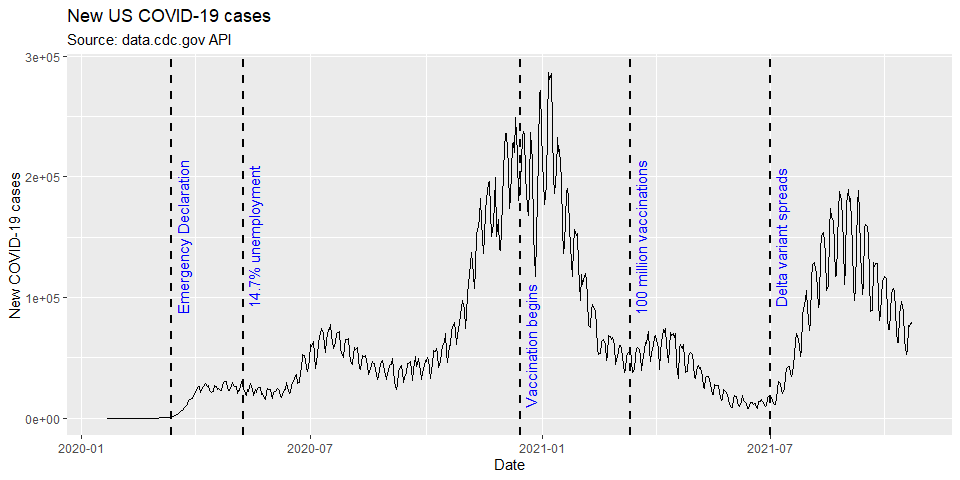

This timeline helps provide a framework for interpreting the following
simple plots:

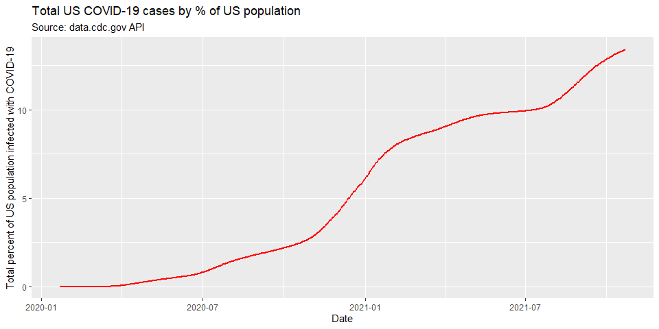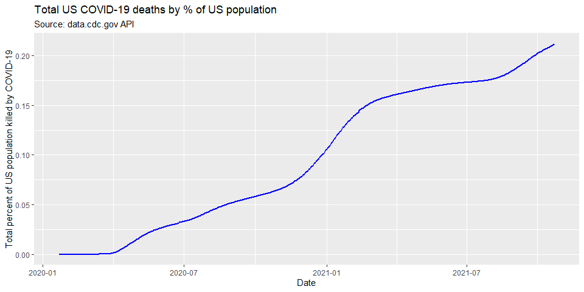

There has been considerable difference between how each of the US States
has experienced COVID-19:

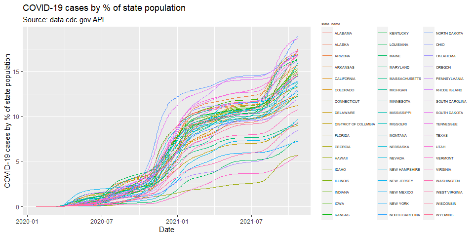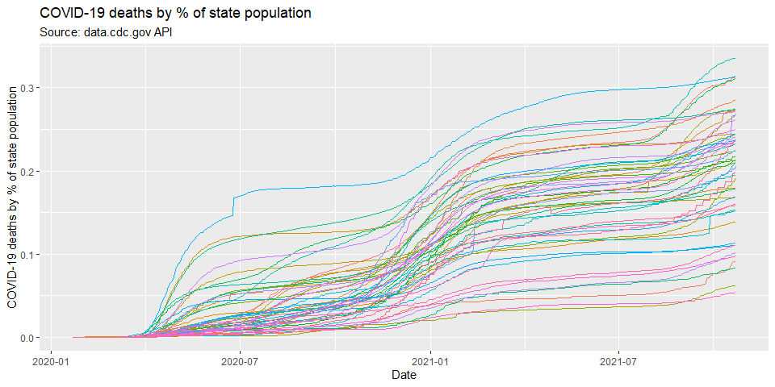

The state with the highest number deaths per population, MISSISSIPPI,
experienced per population mortality rates 623% higher than that of the
lowest number of deaths per population, VERMONT.

These differences are a result of a complicated web of interconnected
variables: geography, viral transmission tendencies, the extent to which
the state and local governments enforced lockdown measures, the culture
of the communities and how rigorously they practiced social distancing,
the types of economies typical of each region, and many more.

Having the above information in hand will help provide perspective as a
preliminary investigation into US drug useage patterns is explored.

## The drug mortality crisis in the US

The CDC provides a vast and thorough dataset giving monthly 12-month
rolling summaries of overdose deaths, by state, categorized by drug type
(heroin, cocaine, opioids, etc.) as well as drug type subcategories
(synthetic opioids, natural & semi-synthetic opioids, etc.):

(Note: No data regarding specific drug types is available for the years
of 2016 and 2017. I’m searching for a way to fill in this data)

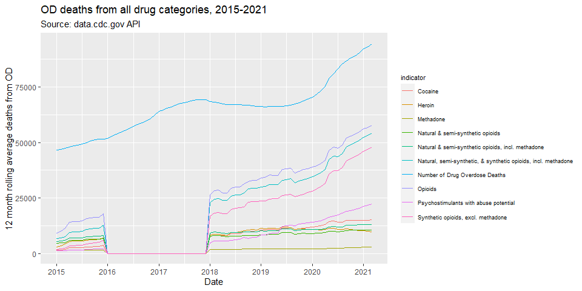
Zooming in on the most telling parts of this graph:

Shown below is overdoses in the US from 2018-2021, broken down by drug
type and subtype. Some of these are independent of all others:
Psychostimulants (methamphedamine) and cocaine have their own
categories. Others share data: there is one category for all opioids,
another for natural opioids, and another for synthetic opioids.

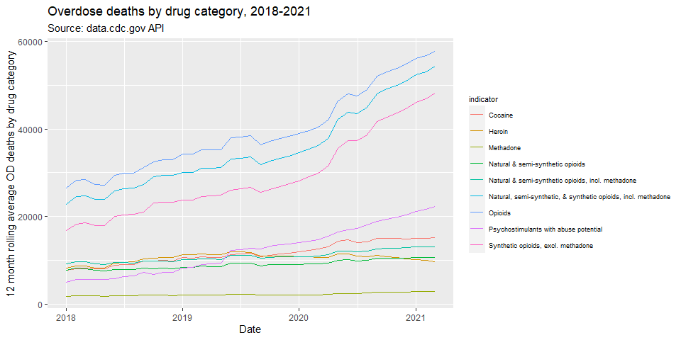

The following graph immediately suggests some insights. For one, there
does appear to be a clear acceleration in the rate of drug overdose
deaths following the onset of the COVID-19 pandemic. Another is
regarding the types of drugs involved: It is opioids that are by far the
most implicated drug, and it’s the synthetic, not the natural opioids,
that are the primary driver. Natural opioids are those such as morphine
and codeine; common semi-synthetic opioids are heroin and oxycodone.

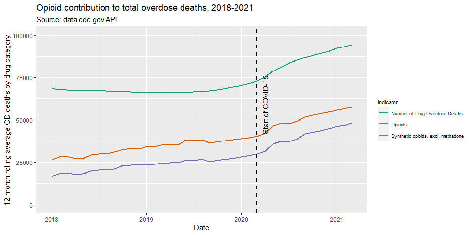

The synthetic opioid behind this great increase is fentanyl, which is
often illicitly manufactured and commonly used to lace other drugs.
There has been considerable media coverage of the rise of fentanyl and
the damage it is causing the US, and many government agencies have
declared an “opioid epidemic.”

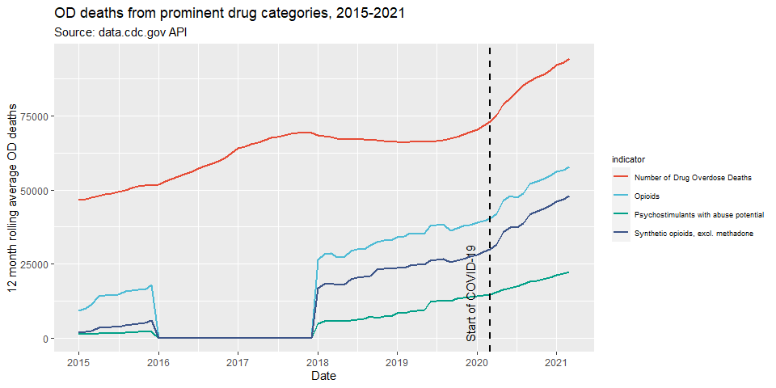

In January 2015 - the earliest data provided in this dataset - synthetic
opioids accounted for 4% of all overdose deaths. As of March 01, 2021 -
the most recent data provided in this dataset - synthetic opioids were
responsible for 51% of all drug overdose deaths in the US. During this
time, the total number of deaths due to synthetic opioids grew by 2491%.

Similar to the disparity in how each state experienced the COVID-19
pandemic, each state is experiencing the drug epidemic in its own way:
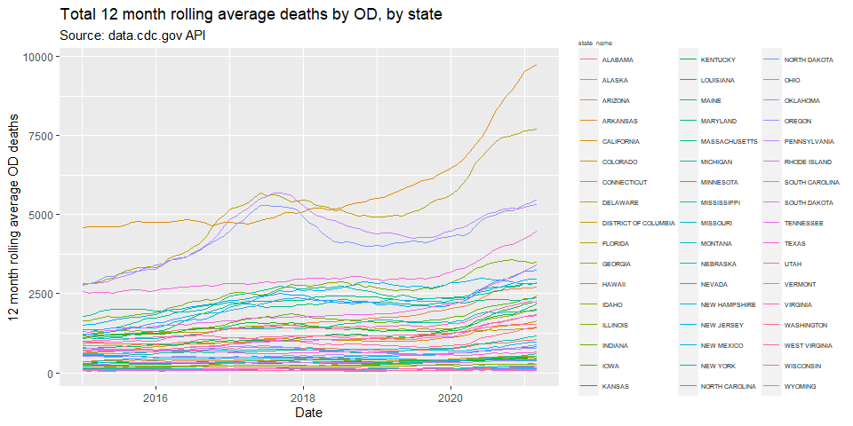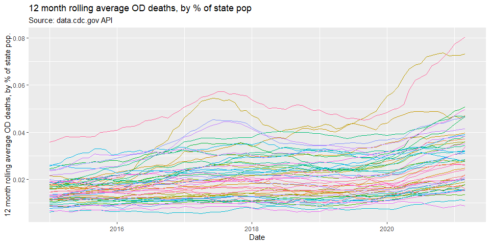

The reason why states are experiencing the drug overdose epidemic so
differently begs further investigation.

Here are two ways of probing this question with graphs:

Plotting to investigate whether those states which experienced the most
COVID-19 cases per capita also experienced the greatest relative
increase in deaths due to overdose in the same time period,

OR

Similarly, whether COVID-19 deaths per capita is correlated with all
overdose deaths in the same timeframe, per capita:

    ## `geom_smooth()` using method = 'loess' and formula 'y ~ x'

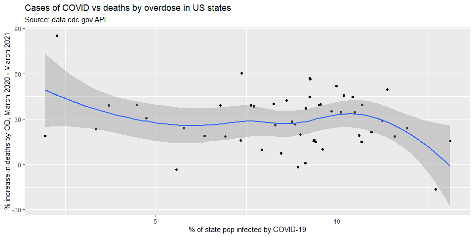

    ## `geom_smooth()` using method = 'loess' and formula 'y ~ x'

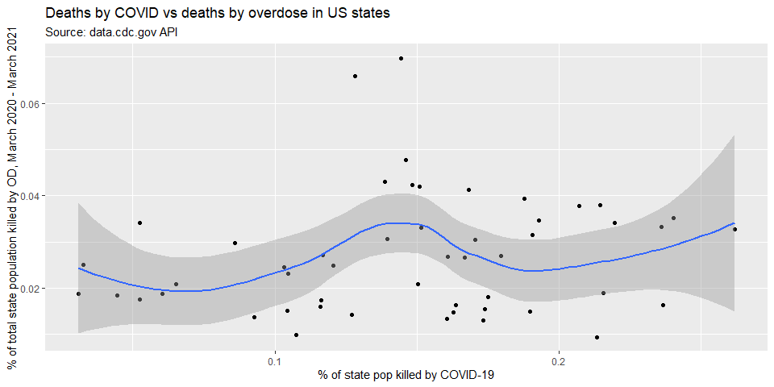

These visualizations indicate that there is either no relation between
the two factors, or there is even a negative correlation.

While this may seem counterintuitive, COVID-19 affected the US in more
ways than just the mortalities from the virus itself. The economic
shutdown and enforced social distancing changed the way we live our
entire lives, and these are the types of disruptions that could lead to
increased drug usage: social isolation, joblessness, and the associated
mental health effects. One conjecture which might explain the lack of
correlation seen above is that those states which experienced the lowest
COVID-19 mortalities perhaps enforced the most severe lockdowns -
resulting in lower virus associated deaths but higher social isolation
and a more damaged economy.

This aspect of the question requires further investigation.

## Conclusion

This investigation has only suggested more directions of research that
should be pursued. I would have liked to do more preliminary
investigating of the regional characteristics of both the COVID-19 and
drug overdose datasets using the library leaflet, but it was out of the
scope of this report. I would like to merge economic data into this
analysis, allowing me to consider the degree to which state economies
suffered from the COVID-19 associated shutdowns, to see if interesting
correlations with drug usage can be discovered. I am interested in
finding more spatially precise datasets, perhaps at the county level, as
each state contains a multitude of regions which act independently of
one another. I feel that this topic is an important and interesting one
with many insights left to discover, and I intend to continue pursuing
it.

## Methods

Data regarding the population of the US and its States was collected
from the census.gov’s API portal. It was converted to a data.table by
the methods instructed in lecture, and associated with other data.tables
using the data.table merge method. The COVID-19 data was accessed via
the data.cdc.gov API portal. It was merged with census data to calculate
COVID-19 infections and deaths as a percentage of the state population.
Data regarding drug overdoses in the USA was also accessed through the
data.cdc.gov API. It was merged with the census data to be able to
calculate overdose percentages by state population. Later, it was merged
with the COVID-19 data to investigate the relationship between overdoses
and COVID-19 infection rates. The data was very reliable, as it was
thoroughly gathered by the CDC, and needed very little cleaning or
wrangling. Data exploration was mainly done visually using ggplot2 line
and scatterplots, most of which are shown in this report.

## Sources

<https://www.cdc.gov/museum/timeline/covid19.html>

<https://www.cdc.gov/drugoverdose/deaths/synthetic/index.html>

<https://www.hhs.gov/opioids/about-the-epidemic/index.html>

<https://www.cdc.gov/museum/timeline/covid19.html>

<https://data.cdc.gov/NCHS/VSRR-Provisional-Drug-Overdose-Death-Counts/xkb8-kh2a>
